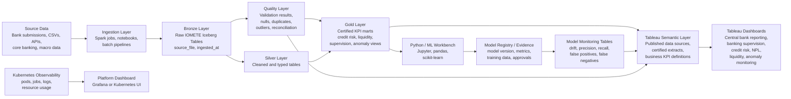

# AI and Quality-Driven Dashboards for Banking and Central Banking

**Repository target:** `docs/ai-quality-driven-dashboards-banking-central-banking.md`  
**Platform context:** IOMETE deployed on Kubernetes  
**Prepared for:** IOMETE banking data quality, analytics, and AI/ML demonstration  
**Date:** July 2026  

---

## 1. Executive Summary

This report proposes a practical, enterprise-grade approach for building **quality-driven dashboards for banking and central banking** using the current platform direction: **IOMETE deployed on Kubernetes** as the lakehouse foundation, **Apache Spark and Apache Iceberg** as the analytical processing and table foundation, **Tableau** as the governed dashboarding and reporting layer, and **Python-based AI/ML** as the analytics extension for anomaly detection, credit scoring, model monitoring, and decision intelligence.

The recommended approach is not to build an isolated "AI dashboard." The stronger approach is to build a **trusted banking reporting platform** where every dashboard KPI can be traced back to:

1. the source file or source system,
2. the Bronze, Silver, Quality, and Gold layer transformation path,
3. the data quality checks applied,
4. the semantic definition of the metric,
5. the dashboard or Tableau workbook consuming it,
6. the responsible data owner,
7. the validation status,
8. and, where AI/ML is used, the model version, training dataset, evaluation metrics, and monitoring status.

For a central bank or banking regulator, this is essential. Dashboards are not only visual tools; they are decision artefacts. They must support supervisory confidence, internal audit review, data quality evidence, and executive decision-making.

The best target architecture is therefore a **dual-surface architecture**:

- **Tableau dashboards** for executives, regulators, supervisors, risk teams, banking analysts, and decision-makers.
- **IOMETE/Kubernetes operational dashboards** for data engineers, platform teams, and ML engineers.

Tableau should not replace observability tools, and observability tools should not replace executive dashboards. The two layers should be connected through shared metadata, quality scorecards, lineage tables, and certified Gold-layer views.

---

## 2. Baseline From the Current Demonstration

The current demonstration already establishes an important foundation:

- IOMETE is used as the lakehouse platform.
- Apache Spark connects to the IOMETE catalog.
- Apache Iceberg supports structured lakehouse tables.
- Tableau connects to the lakehouse through JDBC.
- Tableau Desktop is used for dashboard authoring.
- Tableau Server is the intended publishing and sharing layer.
- Tableau extracts are recommended as the default mode for predictable performance.
- Python notebooks are used for analysis and ML workflows.
- pandas, scikit-learn, and Random Forest classification were demonstrated for anomaly detection.
- Data quality is treated as an explicit workflow, covering nulls, duplicates, outliers, completeness, provenance, and sanity checks.
- Credit risk and anomaly detection are the immediate business use cases.
- The dashboard scope includes NPL rate, geography, macroeconomic context, PoS anomaly detection, and future credit scoring.

The important next step is to turn this into a formal **dashboard and data quality architecture** that can satisfy central banking expectations.

---

## 3. Strategic Recommendation

Use IOMETE on Kubernetes as the **system of record for analytical data products**.

Use Tableau as the **certified dashboard consumption layer**.

Use Python/MLflow-style model tracking as the **AI/ML evidence layer**.

Use dedicated data quality tables in IOMETE as the **trust layer** between data engineering, machine learning, and dashboard reporting.

The most important design principle is:

> No dashboard KPI should be trusted unless the data quality status, lineage path, refresh time, and owner are visible.

This applies to traditional dashboards and AI/ML-powered dashboards.

---

## 4. Target Architecture



---

## 5. IOMETE-on-Kubernetes Design Principles

Because the platform is IOMETE deployed on Kubernetes, the report architecture should be Kubernetes-native.

### 5.1 Platform layer

The platform layer should include:

| Area | Recommended approach |
|---|---|
| Compute | IOMETE Spark sessions and jobs running on Kubernetes |
| Table format | Apache Iceberg tables managed through IOMETE catalog |
| Storage | Object storage compatible with S3, such as MinIO in the lab or enterprise object storage in production |
| Namespace model | Separate namespaces for platform components and data-plane workloads |
| Resource control | Parameterised CPU and memory allocation for notebooks, Spark jobs, and query sessions |
| Access control | Role-based access to namespaces, catalogs, schemas, and dashboard data products |
| Monitoring | Kubernetes pod status, Spark job health, query performance, and storage usage |
| Promotion | Development → demo → production data products through controlled SQL and job scripts |

### 5.2 Medallion design

The banking data platform should use a medallion structure:

| Layer | Purpose | Example tables |
|---|---|---|
| Bronze | Raw landed data with lineage | `bronze.exchange_rates`, `bronze.pos_transactions`, `bronze.credit_accounts` |
| Quality | Validation and exception evidence | `quality.data_quality_results`, `quality.duplicate_records`, `quality.reconciliation_summary` |
| Silver | Cleaned, typed, conformed data | `silver.exchange_rates`, `silver.pos_transactions`, `silver.credit_accounts` |
| Gold | Dashboard-ready marts and KPIs | `gold.credit_risk_kpis`, `gold.npl_summary`, `gold.bank_supervision_scorecard` |
| ML | Features, predictions, and monitoring | `ml.transaction_anomaly_scores`, `ml.model_quality_metrics`, `ml.feature_drift_summary` |

---

## 6. Dashboard Strategy for Banking and Central Banking

A banking dashboard programme must cover more than visuals. It must support regulatory reporting, risk monitoring, macro-financial analysis, internal supervision, and management decision-making.

### 6.1 Recommended dashboard catalogue

| Dashboard | Audience | Purpose | Example KPIs |
|---|---|---|---|
| Executive Banking Overview | Governor, executives, board, senior management | One-page view of banking sector or portfolio health | Total assets, total loans, deposits, NPL ratio, capital adequacy, liquidity ratio |
| Credit Risk Overview | Credit risk, supervision, commercial bank risk teams | Monitor portfolio quality and risk concentration | NPL rate, arrears, provisions, exposure by sector, exposure by geography |
| NPL Monitoring Dashboard | Banking supervision and risk teams | Track non-performing loans by bank, sector, region, and time | NPL ratio, NPL value, cure rate, write-offs, coverage ratio |
| Liquidity Dashboard | Treasury, supervision, central bank analysts | Monitor liquidity and funding stability | Liquid assets, liquidity coverage, deposit concentration, funding gaps |
| Capital Adequacy Dashboard | Prudential supervision | Track bank capital strength | CAR, Tier 1 ratio, leverage ratio, risk-weighted assets |
| Regulatory Returns Dashboard | Central bank reporting teams | Monitor submission completeness and timeliness | submitted returns, late returns, validation failures, resubmission count |
| Data Quality Scorecard | Data owners, supervisors, engineers, audit | Evidence whether data can be trusted | completeness, uniqueness, validity, freshness, reconciliation status |
| Transaction Anomaly Dashboard | Fraud/risk teams and supervisors | Detect abnormal PoS or transactional behaviour | anomaly count, anomaly rate, anomaly type, severity, affected merchants |
| AI/ML Model Monitoring Dashboard | Model risk, data science, audit | Monitor model performance and governance | precision, recall, F1, drift, false positives, false negatives, approval status |
| Geographic Risk Dashboard | Supervision and policy teams | Map concentration and emerging risk | NPL by district, exposure by province, anomaly hotspots, underserved areas |
| Publication/Statistics Dashboard | Central bank statistics teams | Govern official statistics and public releases | release calendar, revision count, methodology version, publication approval |

### 6.2 Tableau role

Tableau should be used for:

- executive scorecards,
- regulatory dashboards,
- banking supervision dashboards,
- self-service analysis,
- certified published data sources,
- geospatial risk views,
- Tableau extracts for predictable performance,
- Tableau alerts for KPI threshold breaches,
- Tableau Prep where business-controlled preparation is acceptable,
- Tableau Catalog/Data Management where lineage and trust features are licensed.

### 6.3 What should stay outside Tableau

Tableau should not become the operational control plane for everything. The following should remain in engineering or platform tools, with only summarised outputs exposed to Tableau:

- Kubernetes pod-level troubleshooting,
- Spark executor logs,
- object storage internals,
- CI/CD deployment logs,
- raw ML experiment details,
- high-cardinality telemetry,
- debugging-level traces.

Tableau should consume summary tables from IOMETE, not raw operational noise.

---

## 7. KPI Framework

A dashboard platform should define KPIs before building visuals.

### 7.1 Banking and central banking KPIs

| Category | KPI | Description |
|---|---|---|
| Credit risk | NPL ratio | Non-performing loans divided by gross loans |
| Credit risk | Provision coverage ratio | Loan loss provisions divided by NPLs |
| Credit risk | Portfolio at risk | Loans overdue beyond defined threshold |
| Credit risk | Sector exposure | Exposure by industry or economic sector |
| Credit risk | Geographic concentration | Exposure or NPLs by district/province |
| Capital | Capital adequacy ratio | Regulatory capital divided by risk-weighted assets |
| Capital | Tier 1 ratio | Tier 1 capital divided by risk-weighted assets |
| Liquidity | Liquid asset ratio | Liquid assets divided by total assets or liabilities |
| Liquidity | Deposit concentration | Share of deposits by top depositors or sectors |
| Profitability | ROA | Return on assets |
| Profitability | ROE | Return on equity |
| Stability | Bank risk score | Composite score across credit, liquidity, capital, profitability, and data quality |
| Supervision | Return submission rate | Percentage of expected returns received |
| Supervision | Validation pass rate | Percentage of submitted returns passing validation |
| Supervision | Resubmission count | Number of corrected submissions |
| Statistics | Publication timeliness | Whether official outputs were released on schedule |

### 7.2 Data quality KPIs

| Dimension | KPI | Calculation |
|---|---|---|
| Completeness | Completeness rate | non-null required fields / required fields |
| Uniqueness | Duplicate rate | duplicate business keys / total records |
| Validity | Valid value rate | records passing domain rules / total records |
| Freshness | Data freshness lag | current timestamp - latest ingested timestamp |
| Reconciliation | Reconciliation difference | source count - target count |
| Consistency | Cross-table consistency rate | records matching reference/master data / total records |
| Accuracy | Manual exception rate | confirmed incorrect records / sampled records |
| Lineage | Lineage coverage | records with source_file and ingested_at / total records |
| Certification | Certified data product rate | certified dashboard data sources / total dashboard data sources |

### 7.3 AI/ML KPIs

| Category | KPI | Why it matters |
|---|---|---|
| Classification performance | Precision | Controls false positives |
| Classification performance | Recall | Controls missed anomalies or missed risk cases |
| Classification performance | F1 score | Balances precision and recall |
| Model reliability | Drift score | Detects change in data behaviour |
| Model operations | Prediction volume | Shows how often the model is used |
| Model operations | Latency | Ensures model output is available in time |
| Model governance | Model approval status | Shows whether model is approved for production use |
| Model governance | Training data version | Links predictions back to data used for training |
| Model risk | False positive cost | Shows review burden |
| Model risk | False negative cost | Shows missed-risk exposure |

---

## 8. Data Quality Framework

The dashboard platform should include a formal data quality framework. This is especially important because central bank dashboards depend on trust.

### 8.1 Minimum quality checks

For every major table:

1. record count by source file,
2. record count by Bronze/Silver/Gold stage,
3. null count for required fields,
4. duplicate check on business keys,
5. invalid value checks,
6. date range checks,
7. negative value checks where values should not be negative,
8. reference-data matching,
9. outlier detection,
10. reconciliation between layers,
11. lineage fields present,
12. freshness and ingestion timestamp checks.

### 8.2 Recommended quality mart

Create a standard quality mart in IOMETE:

```sql
CREATE TABLE IF NOT EXISTS quality.data_quality_results (
    run_id STRING,
    check_timestamp TIMESTAMP,
    catalog_name STRING,
    schema_name STRING,
    table_name STRING,
    layer_name STRING,
    check_name STRING,
    check_dimension STRING,
    check_status STRING,
    severity STRING,
    records_checked BIGINT,
    records_failed BIGINT,
    failure_rate DOUBLE,
    source_file STRING,
    ingested_at TIMESTAMP,
    rule_description STRING,
    owner STRING,
    remediation_status STRING,
    notes STRING
);
```

This table becomes the source for the Tableau **Data Quality Scorecard**.

### 8.3 Quality dashboard layout

The data quality dashboard should include:

- total checks run,
- pass/fail count,
- failed checks by severity,
- failed checks by table,
- failed records by source file,
- records left behind between Bronze/Silver/Gold,
- duplicate count by table,
- null count by field,
- freshness status,
- reconciliation status,
- owner and remediation status.

---

## 9. Tableau Dashboard Architecture

### 9.1 Connection mode

For the banking dashboard use case, Tableau should default to **extracts** for executive dashboards and scheduled reporting, because extracts provide predictable performance and reduce repeated pressure on the lakehouse.

Use **live connections** selectively for:

- smaller operational views,
- near-real-time monitoring,
- analyst exploration,
- controlled development workbooks.

Recommended pattern:

| Use case | Tableau mode |
|---|---|
| Executive dashboard | Extract |
| Regulatory reporting dashboard | Extract |
| Data quality dashboard | Extract, refreshed after validation jobs |
| Anomaly monitoring | Extract or live depending on refresh need |
| Analyst exploration | Live during development |
| Published certified data source | Extract where possible |

### 9.2 Published data sources

Do not connect every workbook directly to raw tables.

Recommended flow:

`IOMETE Gold View` → `Tableau Published Data Source` → `Dashboard Workbook`

This ensures:

- one metric definition,
- one refresh policy,
- easier certification,
- fewer inconsistent dashboards,
- easier governance.

### 9.3 Certified dashboard layers

Use three dashboard zones:

| Zone | Description |
|---|---|
| Development | Analyst workbooks and experiments |
| Certified | Approved Tableau dashboards for management and supervision |
| Published/Board | Final reports used in executive or official contexts |

Only Gold-layer data products should feed Certified and Published dashboards.

---

## 10. AI and ML Quality Framework

AI and ML should extend the dashboard programme, not replace it.

### 10.1 ML lifecycle

Recommended ML lifecycle:

1. define business use case,
2. define label and target variable,
3. create feature dataset from Silver/Gold IOMETE views,
4. run exploratory data analysis,
5. check nulls, duplicates, outliers, and leakage,
6. train baseline model,
7. evaluate precision, recall, F1, and confusion matrix,
8. validate across segments and geography,
9. register model version,
10. score new data,
11. write predictions back to IOMETE,
12. monitor drift and performance,
13. expose model outputs in Tableau.

### 10.2 Recommended ML tables

```sql
CREATE TABLE IF NOT EXISTS ml.model_registry_summary (
    model_name STRING,
    model_version STRING,
    use_case STRING,
    training_dataset STRING,
    training_period_start DATE,
    training_period_end DATE,
    algorithm STRING,
    precision DOUBLE,
    recall DOUBLE,
    f1_score DOUBLE,
    approval_status STRING,
    approved_by STRING,
    approved_at TIMESTAMP,
    notes STRING
);
```

```sql
CREATE TABLE IF NOT EXISTS ml.transaction_anomaly_scores (
    score_id STRING,
    transaction_id STRING,
    scored_at TIMESTAMP,
    model_name STRING,
    model_version STRING,
    anomaly_score DOUBLE,
    anomaly_flag BOOLEAN,
    anomaly_type STRING,
    severity STRING,
    explanation STRING
);
```

```sql
CREATE TABLE IF NOT EXISTS ml.model_monitoring_metrics (
    metric_timestamp TIMESTAMP,
    model_name STRING,
    model_version STRING,
    metric_name STRING,
    metric_value DOUBLE,
    threshold_value DOUBLE,
    status STRING,
    segment_name STRING,
    notes STRING
);
```

### 10.3 Model risk controls

For banking and central banking, every model should have:

- documented purpose,
- approved data sources,
- training data version,
- evaluation results,
- known limitations,
- human review process,
- approval owner,
- monitoring thresholds,
- retirement criteria.

---

## 11. Recommended Technology Stack

### 11.1 Current lab-aligned stack

| Layer | Recommended technology |
|---|---|
| Kubernetes | K3s or enterprise Kubernetes |
| Lakehouse platform | IOMETE |
| Processing | Apache Spark through IOMETE |
| Table format | Apache Iceberg |
| Object storage | MinIO in lab; enterprise S3-compatible object storage in production |
| SQL development | IOMETE SQL editor and scripts in repo |
| Notebook analysis | Jupyter / Python |
| ML libraries | pandas, scikit-learn |
| Model tracking | MLflow or lightweight model registry tables initially |
| BI | Tableau Desktop + Tableau Server |
| Data prep | Tableau Prep where appropriate |
| Dashboard governance | Published data sources, certified dashboards, quality scorecards |
| Observability | Kubernetes metrics, Spark job logs, optional Prometheus/Grafana |

### 11.2 Production-grade extensions

| Need | Recommended extension |
|---|---|
| Data lineage | OpenLineage, DataHub, OpenMetadata, or Tableau Catalog where licensed |
| Model tracking | MLflow Tracking and Model Registry |
| Data validation | Great Expectations, Soda, dbt tests, or custom Spark SQL quality checks |
| Feature store | Feast or curated IOMETE feature tables |
| Workflow orchestration | Airflow, Dagster, Prefect, or Kubernetes CronJobs |
| Secrets | Kubernetes Secrets, Vault, or cloud secret manager |
| Monitoring | Prometheus and Grafana |
| Alerting | Alertmanager, email, Slack/Teams, or ticketing integration |
| CI/CD | GitHub Actions or GitLab CI |
| Infrastructure as code | Helm, Terraform, Kustomize |

---

## 12. Implementation Roadmap

### Phase 1: Foundation

Deliverables:

- confirm dashboard catalogue,
- define KPI dictionary,
- define quality dimensions,
- confirm Gold-layer tables/views,
- create `quality.data_quality_results`,
- create initial Tableau data quality dashboard,
- document architecture in GitHub.

### Phase 2: Certified banking dashboards

Deliverables:

- Credit Risk Overview,
- NPL Monitoring Dashboard,
- Geographic Risk Dashboard,
- Regulatory Submission Dashboard,
- Executive Banking Overview,
- published Tableau data sources,
- extract refresh schedules.

### Phase 3: AI/ML integration

Deliverables:

- transaction anomaly scoring table,
- model registry summary table,
- model monitoring metrics table,
- anomaly detection dashboard,
- model quality dashboard,
- model approval checklist.

### Phase 4: Governance and audit

Deliverables:

- dashboard certification workflow,
- data owner matrix,
- source-to-dashboard lineage documentation,
- quality exception workflow,
- audit evidence pack,
- controlled promotion from development to certified dashboards.

### Phase 5: Production hardening

Deliverables:

- Kubernetes resource tuning,
- scheduled Spark quality jobs,
- automated extract refreshes,
- monitoring and alerting,
- backup and recovery process,
- role-based access control,
- production deployment guide.

---

## 13. Repository Structure Recommendation

Add or align these files in the repository:

```text
docs/
  ai-quality-driven-dashboards-banking-central-banking.md
  dashboard-catalogue.md
  data-quality-framework.md
  tableau-architecture.md
  ml-anomaly-detection-framework.md
  governance-and-approval-model.md

sql/
  bronze/
  quality/
    01_create_quality_results.sql
    02_quality_checks.sql
  silver/
  gold/
    credit_risk_kpis.sql
    npl_summary.sql
    regulatory_returns_summary.sql
  ml/
    model_registry_summary.sql
    transaction_anomaly_scores.sql
    model_monitoring_metrics.sql

notebooks/
  anomaly_detection/
  data_quality_exploration/

tableau/
  published-data-sources/
  dashboard-specifications/
```

---

## 14. Dashboard Acceptance Criteria

A dashboard is production-ready only when:

- it reads from Gold or approved Quality/ML tables,
- KPI definitions are documented,
- data owner is assigned,
- refresh frequency is defined,
- source tables are documented,
- quality checks pass or exceptions are approved,
- Tableau data source is published and certified,
- row-level or role-based access is configured,
- dashboard purpose and audience are documented,
- screenshots or workbook references are stored,
- approval is recorded.

---

## 15. Risks and Remediation

| Risk | Impact | Remediation |
|---|---|---|
| Dashboards built directly on raw tables | Inconsistent numbers | Only certify dashboards using Gold views |
| Weak data quality evidence | Loss of trust | Maintain quality scorecard and exception tables |
| Too many KPIs | Confusing dashboard | Use KPI dictionary and dashboard catalogue |
| Tableau extracts become stale | Wrong decisions | Add refresh monitoring and freshness KPIs |
| ML model overfits | Bad anomaly detection | Use precision, recall, F1, validation data, and drift monitoring |
| No lineage | Audit weakness | Keep source_file, ingested_at, run_id, and transformation documentation |
| Kubernetes sessions under-provisioned | Slow jobs or failures | Parameterise memory and CPU by workload |
| Manual dashboard promotion | Governance gaps | Define dev → certified → published workflow |
| AI output trusted blindly | Model risk | Add human review, model approval, and explanation fields |

---

## 16. Final Recommendation

The recommended platform direction is:

> **IOMETE on Kubernetes as the governed lakehouse, Tableau as the certified business dashboard layer, and Python/ML as an evidence-driven analytics extension.**

The best dashboard is not the one with the most visuals. The best dashboard is the one where decision-makers can trust the number, understand the source, see the data quality status, and act quickly.

For the current project, the immediate next steps are:

1. create the quality mart in IOMETE,
2. build the Tableau Data Quality Scorecard,
3. build the Credit Risk Overview dashboard from Gold views,
4. build the NPL Monitoring dashboard,
5. build the Regulatory Returns dashboard,
6. add anomaly scoring outputs into IOMETE,
7. expose anomaly and model quality metrics in Tableau,
8. document dashboard certification and approval in GitHub.

This turns the demo into a credible central-bank-ready analytics platform.

---

## 17. References

- Basel Committee on Banking Supervision. *Principles for effective risk data aggregation and risk reporting (BCBS 239).* Bank for International Settlements.
- NIST. *Artificial Intelligence Risk Management Framework.*
- Tableau Help. *About Tableau Catalog.*
- Tableau Help. *Set a Data Quality Warning.*
- MLflow Documentation. *ML Experiment Tracking.*
- TensorFlow Extended Documentation. *TensorFlow Data Validation and TensorFlow Model Analysis.*
- scikit-learn Documentation. *Model evaluation: quantifying prediction quality.*
- Kubernetes Documentation. *Production-grade container orchestration.*
- Apache Iceberg Documentation. *Open table format for huge analytic datasets.*
- IOMETE project documentation and current project implementation notes.
