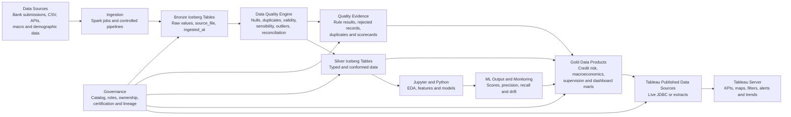

# Banco de Moçambique Analytics, Data Quality, Tableau and Machine Learning Proposal

**Platform context:** IOMETE lakehouse on Kubernetes, Apache Spark, Apache Iceberg, Jupyter/Python and Tableau  
**Prepared for:** Banco de Moçambique proof of concept and architecture decision  
**Repository target:** `docs/banco-de-mocambique-analytics-data-quality-ml-proposal.md`  
**Date:** July 2026

---

## 1. Executive Summary

This proposal turns the proof-of-concept workshop notes into a practical analytics and decision-support solution for Banco de Moçambique.

The target platform should allow decision-makers to:

- see whether data is complete, valid, unique, timely and reconciled;
- identify exactly which records did not progress from Bronze to Silver or Gold;
- inspect duplicates, nulls, invalid values and outliers;
- monitor banking and macroeconomic indicators such as inflation, GDP, exchange rates, policy rates and credit growth;
- analyse non-performing loans and credit risk by bank, sector, province and district;
- publish interactive Tableau dashboards with alerts, thresholds, trends and geographic views;
- use Jupyter and Python for exploratory analysis, anomaly detection and future credit-scoring models;
- connect dashboards and models to governed Apache Iceberg tables in IOMETE.

The solution should not be presented as only a dashboard. It is a trusted decision platform with four connected capabilities:

1. **IOMETE lakehouse** for governed storage and processing.
2. **Data quality and reconciliation** for evidence that the data can be trusted.
3. **Tableau** for reporting, visual analysis and executive decision support.
4. **Python/Jupyter machine learning** for anomaly detection, credit scoring and model experimentation.

> Every KPI must be traceable to its source, transformation path, data-quality result, business definition and refresh timestamp.

---

## 2. Questions the Solution Must Answer

### Data trust

- How many records arrived from each source?
- How many reached Bronze, Silver and Gold?
- Which records were left behind, and why?
- Where are failed records stored?
- Which datasets contain duplicates?
- Which required fields contain nulls?
- Which values are outside sensible business ranges?
- What is the data-quality score by dataset, bank and reporting period?
- Were failed records corrected, accepted as exceptions or rejected?

### Banking supervision and credit risk

- What is the current NPL rate?
- How is NPL evolving over time?
- Which banks, sectors, provinces or districts have the highest risk?
- Is NPL coverage improving or deteriorating?
- Are loan concentrations increasing?
- Are there unusual transaction patterns?

### Macroeconomic analysis

- How are inflation, GDP growth, exchange rates, credit growth and policy rates evolving?
- Do macroeconomic changes correlate with credit quality?
- Which provinces or sectors are most exposed to macroeconomic stress?

### Data science

- Can historical anomalies train a useful model?
- Which features are associated with abnormal PoS transactions?
- Can approved network or WiFi telemetry support anomaly detection?
- Can the platform support a future credit-scoring model?
- Is the model performing well on an imbalanced dataset?

---

## 3. Current PoC Position and Important Clarification

The PoC has the correct technology direction:

- IOMETE as the lakehouse platform;
- Apache Spark for processing;
- Apache Iceberg tables in the IOMETE catalog;
- Bronze, Silver, Quality and Gold schemas;
- JDBC connectivity for reporting tools;
- Tableau Desktop and Tableau Server as the reporting layer;
- Jupyter notebooks, pandas and scikit-learn for data science.

A report must distinguish between:

- checks that were designed or executed; and
- records that were actually corrected.

A failed quality check does not automatically mean the bad record was sorted out. The target process must preserve the original Bronze record, register the failure, route the record to an exception dataset and track whether it was corrected, accepted or rejected.

---

## 4. Data Quality Reporting Framework

### 4.1 Quality dimensions

| Dimension | Question | Example rule |
|---|---|---|
| Completeness | Are required values present? | Account ID, bank ID and reporting date must not be null |
| Uniqueness | Are business keys duplicated? | One account per bank, account ID and reporting date |
| Validity | Does the value follow an approved domain? | Currency code must exist in reference data |
| Consistency | Do related fields agree? | Performing loans + NPL must equal gross loans |
| Accuracy | Does the value reflect the source? | Confirm against the source or an approved sample |
| Timeliness | Was data received and processed on time? | Submission received before the deadline |
| Integrity | Do relationships resolve? | Every loan references a valid bank |
| Reconciliation | Did counts and totals balance? | Bronze count versus Silver count |
| Lineage | Can each record be traced? | `source_file` and `ingested_at` are populated |
| Sensibility | Is the value economically reasonable? | Exchange rate cannot be negative |

### 4.2 Where records are left behind

Records must never disappear silently.

```text
Source file or system
        ↓
Bronze: preserve every ingested record
        ↓
Quality classification
        ├── PASS → Silver
        ├── WARNING → Silver with warning status, where policy permits
        └── FAIL → remains in Bronze and is registered in a quality exception table
                         ↓
                    remediation
                         ↓
                  Silver and Gold
```

A record that does not reach Silver must be explainable through reconciliation and exception evidence.

### 4.3 Required quality tables

Use the `mzbq_catalog.quality` schema.

| Table | Purpose |
|---|---|
| `quality.rule_catalog` | Defines rules, thresholds, owners and severity |
| `quality.rule_results` | Stores summary results for each execution |
| `quality.rejected_records` | Stores or references rows that failed critical checks |
| `quality.duplicate_records` | Stores duplicate keys and groups |
| `quality.outlier_records` | Stores statistical and business-rule outliers |
| `quality.reconciliation_summary` | Compares source, Bronze, Silver and Gold |
| `quality.dataset_scorecard` | Stores quality scores |
| `quality.remediation_log` | Tracks correction, acceptance or rejection |
| `quality.pipeline_run` | Stores run status and processing statistics |

Recommended rejected-record structure:

```sql
CREATE TABLE IF NOT EXISTS mzbq_catalog.quality.rejected_records (
    rejection_id STRING,
    run_id STRING,
    dataset STRING,
    source_file STRING,
    source_record_id STRING,
    business_key STRING,
    rule_id STRING,
    rejection_reason STRING,
    severity STRING,
    raw_record_json STRING,
    detected_at TIMESTAMP,
    remediation_status STRING,
    remediation_comment STRING,
    remediated_at TIMESTAMP
);
```

This answers:

- which record was left behind;
- which dataset and source file it came from;
- which rule rejected it;
- whether it has been resolved.

### 4.4 Duplication checks

Duplicates must use defined business keys, not only entire-row comparison.

| Dataset | Suggested business key |
|---|---|
| Bank accounts | `bank_id + account_id + reporting_date` |
| Loans | `bank_id + loan_id + reporting_date` |
| Exchange rates | `currency_code + effective_date + rate_type` |
| PoS transactions | `institution_id + transaction_id` |
| Macroeconomic indicators | `indicator_code + period + geography_code` |

Report:

- total records;
- distinct keys;
- duplicate records;
- duplicate rate;
- affected source files;
- duplicate groups;
- remediation status.

```text
Duplicate Rate = Duplicate Business Keys / Total Records
```

Do not delete raw Bronze records simply to improve the score.

### 4.5 Null and completeness checks

Required fields should have severity:

- **Critical:** cannot progress to Silver.
- **Warning:** may progress with review status.
- **Informational:** profiling only.

Example critical credit-risk fields:

- bank identifier;
- facility or loan identifier;
- reporting date;
- gross exposure;
- outstanding balance;
- loan status;
- currency.

```text
Completeness Rate = Populated Required Fields / Expected Required Fields
```

### 4.6 Sensible-data checks

Examples:

- exchange rates should not be negative;
- gross loans should not be negative;
- NPL should not exceed gross loans without documented adjustment;
- percentages must remain within approved ranges;
- reporting dates should not be far in the future;
- latitude must be between -90 and 90;
- longitude must be between -180 and 180;
- province and district codes must match approved reference data;
- inflation, GDP and policy-rate values must be checked against source metadata and approved bounds.

### 4.7 Reconciliation and records-left-behind report

For every run, create a report similar to:

| Dataset | Source | Bronze | Silver | Gold | Rejected | Duplicate | Warning | Unexplained gap |
|---|---:|---:|---:|---:|---:|---:|---:|---:|
| Loans | 1,000,000 | 1,000,000 | 990,000 | 988,500 | 7,000 | 3,000 | 1,500 | 0 |

Controls:

```text
Source Count = Bronze Count
Bronze Count = Silver Accepted + Rejected + Explicitly Excluded
Silver Count = Gold Included + Gold Excluded with documented reason
```

Any unexplained difference is a pipeline defect, not a normal quality result.

### 4.8 Scorecards

Scorecards must be calculated from rule results, not manually typed in Tableau.

Recommended dimensions:

- completeness;
- uniqueness;
- validity;
- consistency;
- timeliness;
- reconciliation;
- lineage coverage.

Example weighted score:

```text
Overall Quality Score =
  Completeness × 25%
+ Validity × 20%
+ Uniqueness × 15%
+ Consistency × 15%
+ Reconciliation × 15%
+ Timeliness × 5%
+ Lineage × 5%
```

Weights require business and data-governance approval.

The dashboard should show:

- overall score;
- score by dimension;
- score by bank;
- score by dataset;
- trend over time;
- failed critical rules;
- records requiring remediation;
- last refresh;
- data owner and rule owner.

---

## 5. Macroeconomic, Microeconomic and Demographic Data

### 5.1 Macroeconomic indicators

Recommended indicators:

- GDP and GDP growth;
- inflation and consumer-price indicators;
- exchange rates;
- the approved policy-rate field, including the correct MIMO/MPL naming;
- reserve requirements;
- private-sector credit growth;
- fiscal balance where relevant;
- labour-market indicators;
- commodity, energy and food prices;
- balance-of-payments and foreign reserves where available.

### 5.2 Microeconomic and demographic data

Recommended datasets:

- household or enterprise survey indicators;
- population by province and district;
- income, poverty and employment indicators;
- branch, ATM, PoS and agent locations;
- sector and industry reference data;
- bank and financial-institution reference data;
- province and district reference tables;
- approved latitude and longitude data.

### 5.3 Reference model

Create governed reference tables:

- `reference.country`;
- `reference.province`;
- `reference.district`;
- `reference.bank`;
- `reference.economic_sector`;
- `reference.currency`.

Each reference table should contain a stable code, approved name, effective date and active status.

---

## 6. Tableau Dashboard Catalogue

### 6.1 Executive Banking Overview

Audience: Governor, executive committee and senior management.

KPIs:

- total assets;
- gross loans;
- deposits;
- NPL amount;
- NPL rate;
- NPL coverage;
- capital adequacy;
- liquidity;
- private-sector credit growth;
- data-quality score.

Views:

- KPI cards;
- twelve-month and multi-year trends;
- bank comparison;
- sector exposure;
- macroeconomic context;
- quality-status banner.

### 6.2 Credit Risk Overview

KPIs:

- NPL rate and amount;
- provision coverage;
- arrears buckets;
- write-offs;
- cure rate;
- exposure by sector;
- exposure by bank;
- geographic concentration;
- expected loss when approved.

Interactions:

- bank slicer;
- reporting-period filter;
- sector filter;
- province and district filter;
- drill-through to supporting evidence.

### 6.3 Data Quality Scorecard

Views:

- score by dataset and bank;
- failed rules by severity;
- duplicate rate;
- null rate;
- rejected-record count;
- outlier count;
- source-to-Bronze-to-Silver-to-Gold reconciliation;
- records-left-behind table;
- remediation ageing.

### 6.4 Macroeconomic Dashboard

Views:

- GDP and GDP-growth trends;
- inflation;
- policy rate;
- exchange rate;
- credit growth;
- macro indicators compared with NPL movement;
- province or sector comparisons where data is available.

### 6.5 Geographic Risk Dashboard

Tableau configuration:

- assign geographic roles to Country, Province and District;
- use Latitude and Longitude for approved coordinates;
- place geography on **Detail**;
- place bank, branch or district name on **Label**;
- use NPL, exposure or anomaly count on colour or size;
- include KPI, period, source and quality status in tooltips.

### 6.6 PoS Transaction Anomaly Dashboard

Views:

- anomaly count and rate;
- trend over time;
- anomaly type;
- severity;
- merchant or terminal category;
- day of week and hour;
- affected institution;
- geographic hotspot;
- model confidence;
- investigation status.

### 6.7 Optional Network or WiFi Anomaly Dashboard

Where approved Econet WiFi or other telemetry is available:

- outage duration;
- latency and packet-loss anomalies;
- access-point failures;
- utilisation spikes;
- geographic hotspots;
- recurring anomalies by day and time.

Keep this use case separate from banking supervision data unless governance explicitly approves integration.

---

## 7. Tableau Calculated Fields

### NPL rate

```tableau
IF SUM([Gross Loans]) = 0 THEN
    0
ELSE
    SUM([Non Performing Loans]) / SUM([Gross Loans])
END
```

Format as a percentage.

### NPL coverage ratio

```tableau
IF SUM([Non Performing Loans]) = 0 THEN
    0
ELSE
    SUM([Loan Loss Provisions]) / SUM([Non Performing Loans])
END
```

### Data-quality pass rate

```tableau
IF SUM([Records Checked]) = 0 THEN
    0
ELSE
    1 - (SUM([Records Failed]) / SUM([Records Checked]))
END
```

### Duplicate rate

```tableau
IF SUM([Total Records]) = 0 THEN
    0
ELSE
    SUM([Duplicate Records]) / SUM([Total Records])
END
```

### Reconciliation gap

```tableau
SUM([Source Count]) - SUM([Target Count])
```

### Anomaly rate

```tableau
IF COUNT([Transaction ID]) = 0 THEN
    0
ELSE
    SUM(INT([Is Anomaly])) / COUNT([Transaction ID])
END
```

Tableau Agent may help draft formulas, but every calculation must be reviewed against the official KPI definition.

---

## 8. Tableau Design and Publishing

### Tableau Desktop

Use for:

- workbook development;
- calculated fields;
- geographic roles;
- dashboard layout;
- Measure Names and Measure Values;
- actions, parameters and filters;
- live and extract testing.

### Measure Names and Measure Values

Use them for compact comparisons of:

- NPL;
- coverage ratio;
- capital adequacy;
- liquidity;
- data-quality score.

### Live connection

Use when:

- near-real-time analysis is required;
- IOMETE query capacity is sufficient;
- security and source logic must remain central;
- performance has been tested.

### Extract

Use when:

- predictable performance is required;
- only selected fields and periods are needed;
- scheduled refresh is acceptable;
- dashboard workload should be isolated from lakehouse compute.

For the PoC, extracts are the safer default for executive dashboards. Demonstrate live connectivity on selected use cases.

### Tableau Prep

Can support:

- profiling;
- cleaning;
- type conversion;
- duplicate identification;
- joins and unions;
- extract creation.

Core regulatory transformations and quality rules should remain in version-controlled Spark or SQL pipelines.

### Tableau Server

Should provide:

- governed publishing;
- user and group permissions;
- certified data sources;
- scheduled refreshes;
- subscriptions;
- data-driven alerts;
- audit and usage monitoring;
- controlled development, test and production deployment.

### Tableau Public

Use only with synthetic or fully public data. Never publish confidential regulatory or institution-level banking data.

### Alerts and thresholds

Possible alerts:

- NPL above an approved threshold;
- data-quality score below target;
- reconciliation gap greater than zero;
- late regulatory submission;
- anomaly count above baseline;
- extract refresh failure.

### Tableau Agent and natural-language analysis

Example questions:

- show NPL by bank for the last twelve months;
- which province has the largest increase in NPL;
- show failed data-quality rules for the current period;
- compare inflation and credit growth;
- show PoS anomaly rate by day of week.

Before production, confirm supported deployment, LLM provider, security, data residency and licensing.

---

## 9. Machine Learning and Jupyter Framework

### 9.1 Data access

Connect notebooks to IOMETE through Spark or JDBC and read governed Silver or Gold views.

Do not train directly from unmanaged raw files when an approved Iceberg data product exists.

### 9.2 Exploratory data analysis

Minimum checks:

```python
print(df.shape)
print(df.dtypes)
print(df.isna().sum())
print(df.duplicated().sum())
print(df.describe(include="all"))
```

EDA should include:

- data shape;
- types;
- nulls;
- duplicates;
- distributions;
- outliers;
- class balance;
- correlation matrix;
- time trends;
- category frequencies.

### 9.3 Type conversion and feature engineering

```python
import pandas as pd

transactions["amount"] = pd.to_numeric(
    transactions["amount"], errors="coerce"
)
transactions["transaction_timestamp"] = pd.to_datetime(
    transactions["transaction_timestamp"], errors="coerce"
)
transactions["day_name"] = transactions["transaction_timestamp"].dt.day_name()
transactions["hour"] = transactions["transaction_timestamp"].dt.hour
transactions["is_weekend"] = transactions["day_name"].isin(
    ["Saturday", "Sunday"]
)
```

Possible PoS features:

- amount;
- transaction count per terminal;
- time since previous transaction;
- hour;
- day of week;
- weekend indicator;
- merchant category;
- province or district;
- terminal age;
- reversal rate;
- historical average and deviation;
- known anomaly type.

### 9.4 Correlation and feature selection

Use correlation to identify strongly related numeric variables and leakage risk. Do not use correlation alone.

Also evaluate:

- business relevance;
- data availability at prediction time;
- stability;
- leakage;
- explainability;
- regulatory acceptability.

### 9.5 Random Forest baseline

Random Forest is a useful PoC baseline because it:

- handles nonlinear relationships;
- provides feature importance;
- is simpler to govern than deep-learning alternatives;
- can establish a benchmark quickly.

It is not automatically the final production model.

### 9.6 Imbalanced data

Accuracy can be misleading.

Evaluate:

- precision;
- recall;
- F1;
- precision-recall curve;
- confusion matrix;
- false-positive rate;
- false-negative rate;
- investigation workload.

Use class weights, threshold tuning and validated resampling where appropriate. Do not apply synthetic oversampling before the train-test split.

### 9.7 Deep learning

Consider only when:

- enough labelled data exists;
- patterns are sufficiently complex;
- simpler models have been benchmarked;
- compute and governance capacity exist.

Deep learning does not automatically relearn missed patterns without controlled retraining, validation and approval.

### 9.8 Model output tables

Write results to governed Iceberg tables:

- `ml.pos_transaction_anomaly_scores`;
- `ml.credit_risk_scores`;
- `ml.model_performance_metrics`;
- `ml.feature_drift_summary`;
- `ml.prediction_review_outcomes`.

Tableau should read model outputs from tables rather than execute a model for every interaction.

---

## 10. Target Architecture



---

## 11. Compute and Memory Parameterisation

Notebook and Spark sessions need explicit resource profiles.

Record:

- driver CPU and memory;
- executor CPU and memory;
- executor count;
- shuffle partitions;
- dynamic-allocation setting;
- session timeout;
- maximum result size;
- notebook kernel version;
- Python package versions.

The ARM64 single-node lab is appropriate for development and demonstration only. Production sizing must use data volume, concurrent queries, refresh schedules, model workloads and service-level objectives.

---

## 12. Tableau Server Sizing, Licensing and Costing

A final estimate requires:

- Creator, Explorer and Viewer counts;
- concurrent users;
- number and size of extracts;
- refresh frequency;
- live-query workload;
- high availability;
- development, test and production environments;
- backup and disaster recovery;
- Tableau Prep Conductor or Data Management;
- Tableau Agent or external LLM requirements;
- support and training.

| Cost category | Items |
|---|---|
| Tableau licensing | Creator, Explorer, Viewer or capacity model |
| Tableau infrastructure | Server nodes, storage, backup and OS |
| IOMETE | Kubernetes compute, object storage, PostgreSQL and support |
| Data engineering | Ingestion, quality, reconciliation and Gold marts |
| Analytics | Tableau workbooks, semantics and testing |
| Data science | Notebooks, model development and monitoring |
| Security and governance | IAM, auditing, lineage and certification |
| Operations | Monitoring, upgrades and incident response |
| Training | Analysts, administrators, developers and owners |

Do not present a single implementation price before assumptions are approved.

---

## 13. Tableau Accelerators

Accelerators can reduce dashboard design time.

1. Select relevant banking, finance, risk or executive accelerators.
2. Map accelerator fields to certified Gold views.
3. Replace generic KPI definitions with approved local definitions.
4. Apply security, branding, language and governance.
5. Validate every chart and filter.

Accelerators reduce layout work. They do not replace data modelling, quality controls or KPI governance.

---

## 14. Implementation Roadmap

### Phase 1 — Confirm scope

- confirm datasets and owners;
- approve business questions and KPI definitions;
- confirm macroeconomic indicators;
- classify sensitive and public datasets.

### Phase 2 — Complete quality evidence

- implement the rule catalogue;
- create rejected, duplicate, outlier and remediation tables;
- build layer reconciliation;
- produce scorecards;
- remove unexplained record-count differences.

### Phase 3 — Build certified Gold data products

- credit-risk mart;
- NPL mart;
- macroeconomic mart;
- geographic reference views;
- quality scorecard mart;
- anomaly-monitoring mart.

### Phase 4 — Develop Tableau dashboards

- Executive Banking Overview;
- Credit Risk Overview;
- Data Quality Scorecard;
- Macroeconomic Dashboard;
- Geographic Risk Dashboard;
- PoS Anomaly Dashboard.

### Phase 5 — Develop ML PoC

- prepare labelled anomaly data;
- conduct EDA;
- create baseline rules;
- train Random Forest;
- evaluate precision, recall and workload;
- publish anomaly scores to Iceberg;
- visualise results in Tableau.

### Phase 6 — Production decision

- size Tableau Server;
- choose live, extract or hybrid mode;
- confirm IOMETE production topology;
- confirm security and data residency;
- confirm licensing and support;
- agree operating ownership;
- produce final cost and architecture.

---

## 15. Risks and Controls

| Risk | Control |
|---|---|
| Records disappear between layers | Mandatory reconciliation and rejected-record register |
| Quality score hides critical failures | Critical-rule override and severity reporting |
| Dashboard formula differs from policy | Certified KPI catalogue and review |
| Too little labelled data causes overfitting | Baseline rules, cross-validation and limited scope |
| Imbalanced data gives misleading accuracy | Precision, recall, F1 and threshold analysis |
| Live queries overload the lakehouse | Extracts, workload isolation and testing |
| Sensitive data is published publicly | Server permissions and no sensitive Tableau Public data |
| LLM exposes restricted data | Security review, approved provider and residency controls |
| Geographic data is inconsistent | Governed province and district references |
| Model degrades over time | Drift monitoring and controlled retraining |

---

## 16. Final Decision Package

The final presentation should include:

1. Business problem and outcomes.
2. Current PoC capability and gaps.
3. Data-quality statistics, including records left behind.
4. Quality evidence tables.
5. Credit Risk and NPL dashboard.
6. Macroeconomic and geographic dashboard.
7. PoS anomaly notebook and Tableau output.
8. Target IOMETE–Tableau–Python architecture.
9. Security, governance and data residency.
10. Sizing, licensing and cost assumptions.
11. Implementation roadmap.
12. Decision required.

Recommended decision statement:

> Approve a controlled implementation phase that completes the data-quality evidence layer, certifies the first Gold data products, deploys the priority Tableau dashboards and validates one machine-learning anomaly use case before final production sizing and licensing.

---

## 17. Priority Deliverables

- `quality.rejected_records`;
- `quality.reconciliation_summary`;
- duplicate-detail report;
- quality scorecard by bank and dataset;
- Gold NPL and credit-risk views;
- Tableau NPL dashboard;
- province and district reference tables;
- Jupyter PoS anomaly notebook;
- Iceberg anomaly-score table;
- final architecture diagram;
- Tableau Server sizing questionnaire;
- implementation-cost assumptions sheet.

---

## 18. Reference Sources

- [Banco de Moçambique](https://www.bancomoc.mz/)
- [Banco de Moçambique Financial Stability Report, June 2022](https://www.bancomoc.mz/media/grin3aiw/en_422_financial-stability-report_june2022.pdf)
- [World Bank — Mozambique](https://www.worldbank.org/ext/en/country/mozambique)
- [Tableau — Remove Duplicate Rows in Tableau Prep](https://help.tableau.com/current/prep/en-us/prep_remove_duplicates.htm)
- [Tableau — Data-Driven Alerts](https://help.tableau.com/current/pro/desktop/en-us/data_alerts.htm)
- [Tableau — Accelerators](https://www.tableau.com/solutions/exchange/accelerators)
- [Tableau — TabPy](https://www.tableau.com/developer/tools/python-integration-tabpy)
- [Tableau pricing and licensing information](https://www.tableau.com/pricing)
- [IOMETE — Open Source Architecture](https://iomete.com/product/architecture/open-source)

Confirm the latest official publications, product compatibility, licensing and policy-rate terminology during implementation.
