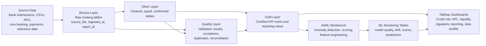

# Medallion Data Handling Best Practices for Banking on IOMETE and Kubernetes

**Repository target:** `docs/medallion-data-handling-best-practices-iomete.md`  
**Platform context:** IOMETE deployed on Kubernetes  
**Use case:** Banking, central banking, data quality, regulatory reporting, Tableau dashboards, and AI/ML analytics  
**Date:** July 2026  

---

## 1. Executive Summary

This report defines a practical medallion data handling strategy for an IOMETE lakehouse deployed on Kubernetes.

The recommended design is a **Bronze → Silver → Quality → Gold → Dashboard/ML** lakehouse architecture where:

- **Bronze** preserves raw source truth.
- **Silver** standardises, cleans, types, and conforms data.
- **Quality** stores validation evidence, reconciliation results, duplicates, null checks, outliers, and exception records.
- **Gold** exposes certified business-ready data products for Tableau, regulatory reporting, risk analytics, and AI/ML.
- **ML/AI layers** consume governed Silver/Gold data and write prediction, anomaly, drift, and model-quality outputs back into IOMETE.
- **Tableau dashboards** consume only certified Gold, Quality, or ML monitoring views.

For banking and central banking, the medallion pattern must be stricter than a normal analytics project. A dashboard number must be explainable, traceable, reconciled, and quality-certified before it is used for supervisory, executive, or regulatory decision-making.

The recommended target architecture is therefore:

> **IOMETE on Kubernetes as the lakehouse execution platform, Apache Iceberg as the open table format, S3-compatible object storage as durable storage, Spark as the processing engine, Quality tables as the trust layer, Gold marts as dashboard-ready products, and Tableau as the certified reporting layer.**

---

## 2. What the Medallion Architecture Means

The medallion architecture is a layered lakehouse design pattern. It progressively improves data quality as data moves through the platform.

| Layer | Meaning | Main purpose |
|---|---|---|
| Bronze | Raw or near-raw source data | Preserve source truth and replayability |
| Silver | Cleaned and conformed data | Standardise and validate records |
| Quality | Validation and exception evidence | Prove whether data can be trusted |
| Gold | Business-ready data products | Serve dashboards, regulatory reporting, and ML |
| ML/AI | Feature, scoring, and model monitoring outputs | Support anomaly detection, credit scoring, and model governance |

Databricks describes the medallion pattern as a way to progressively improve data quality from Bronze to Silver to Gold. Microsoft Fabric uses a similar model where Bronze contains raw data, Silver contains enriched and cleansed data, and Gold contains curated business-level data products.

For IOMETE, the pattern maps naturally to its lakehouse architecture:

- object storage holds the physical data files,
- Apache Iceberg manages table metadata, schema evolution, snapshots, and ACID table operations,
- Apache Spark performs ingestion and transformation,
- IOMETE provides the platform, catalog, compute clusters, SQL access, governance, and integration surface,
- Tableau connects to curated datasets through JDBC/Spark SQL connectivity.

---

## 3. Why This Matters for Banking and Central Banking

Banking data is not ordinary reporting data. It supports risk management, regulatory supervision, financial stability monitoring, credit oversight, and official decision-making.

For a central bank or regulated banking environment, the medallion architecture must answer these questions:

1. Where did the data come from?
2. Which file, system, bank, period, or source generated it?
3. When was it ingested?
4. Was the schema expected?
5. Were any records rejected?
6. Were there duplicates?
7. Were required fields missing?
8. Did totals reconcile between layers?
9. Which table feeds the dashboard?
10. Which KPI definition was used?
11. Who approved the Gold dataset?
12. Is the dashboard using certified data?
13. If AI/ML is used, which model version generated the result?

This aligns strongly with BCBS 239 principles for effective risk data aggregation and risk reporting: accuracy, completeness, timeliness, adaptability, governance, and traceability.

---

## 4. Recommended IOMETE Medallion Architecture



The best structure for the current IOMETE project is:

```text
mzbq_catalog.bronze.*
mzbq_catalog.silver.*
mzbq_catalog.quality.*
mzbq_catalog.gold.*
mzbq_catalog.ml.*
```

Recommended interpretation:

| Schema | Purpose |
|---|---|
| `bronze` | Raw source-aligned data with lineage fields |
| `silver` | Cleaned and standardised data |
| `quality` | Quality checks, failed records, reconciliation, exceptions |
| `gold` | Dashboard-ready and regulatory-reporting-ready data |
| `ml` | Feature tables, model outputs, anomaly scores, drift metrics |

---

## 5. Bronze Layer Best Practices

### 5.1 Purpose

Bronze is the evidence layer. It should preserve the source as closely as possible.

Bronze should answer:

- What arrived?
- When did it arrive?
- From which file or source system?
- Which batch loaded it?
- Can we replay the load?
- Can we prove what the original record looked like?

### 5.2 Bronze rules

| Rule | Recommendation |
|---|---|
| Preserve raw values | Avoid heavy transformation in Bronze |
| Add lineage | Always include `source_file`, `ingested_at`, `batch_id`, and `load_run_id` |
| Avoid business joins | Do not join multiple business sources in Bronze |
| Keep source naming visible | Table names should reflect the source or submission type |
| Store ingestion metadata | Include record count, source path, hash/checksum where possible |
| Support replay | Do not overwrite without a controlled strategy |
| Capture schema drift | Store unexpected columns or schema change evidence |
| Do not silently drop records | Rejected rows must go to a quality/exception table |

### 5.3 Recommended Bronze columns

Every Bronze table should include these technical fields:

```sql
source_file STRING,
source_system STRING,
ingested_at TIMESTAMP,
batch_id STRING,
load_run_id STRING,
record_hash STRING,
raw_record STRING
```

`raw_record` is optional but useful where replay, forensic checks, or audit evidence is important.

### 5.4 Example Bronze table

```sql
CREATE TABLE IF NOT EXISTS mzbq_catalog.bronze.exchange_rates (
    currency_code STRING,
    exchange_rate STRING,
    rate_date STRING,
    source_file STRING,
    source_system STRING,
    ingested_at TIMESTAMP,
    batch_id STRING,
    load_run_id STRING,
    record_hash STRING
)
USING iceberg;
```

In Bronze, numeric fields can remain as strings where the source file is inconsistent. Typing and validation should happen in Silver.

---

## 6. Silver Layer Best Practices

### 6.1 Purpose

Silver is the cleaned and conformed layer. This is where raw data becomes usable analytical data.

Silver should answer:

- Are the data types correct?
- Are required fields present?
- Are duplicates removed or flagged?
- Are invalid values quarantined?
- Are dates, currencies, bank codes, and identifiers standardised?
- Are records linked to reference data?
- Are business keys consistent?

### 6.2 Silver rules

| Rule | Recommendation |
|---|---|
| Enforce data types | Cast strings into dates, decimals, integers, booleans |
| Validate required fields | Nulls in mandatory fields must be flagged |
| Deduplicate | Apply business-key and record-hash duplicate logic |
| Conform reference data | Join to bank, branch, currency, sector, district, and product reference tables |
| Standardise dates | Use consistent date and timestamp formats |
| Standardise amounts | Use decimal precision and currency fields |
| Separate invalid records | Do not silently exclude failed records |
| Keep lineage | Preserve `source_file`, `ingested_at`, and `load_run_id` |
| Add quality status | Add `record_quality_status` where useful |

### 6.3 Example Silver table

```sql
CREATE TABLE IF NOT EXISTS mzbq_catalog.silver.exchange_rates (
    currency_code STRING,
    exchange_rate DECIMAL(18,6),
    rate_date DATE,
    source_file STRING,
    source_system STRING,
    ingested_at TIMESTAMP,
    batch_id STRING,
    load_run_id STRING,
    record_hash STRING,
    record_quality_status STRING
)
USING iceberg;
```

### 6.4 Silver validation examples

```sql
-- Negative exchange rate check
INSERT INTO mzbq_catalog.quality.data_quality_results
SELECT
    uuid() AS run_id,
    current_timestamp() AS check_timestamp,
    'mzbq_catalog' AS catalog_name,
    'silver' AS schema_name,
    'exchange_rates' AS table_name,
    'silver' AS layer_name,
    'negative_exchange_rate_check' AS check_name,
    'validity' AS check_dimension,
    CASE WHEN COUNT(*) = 0 THEN 'PASS' ELSE 'FAIL' END AS check_status,
    'HIGH' AS severity,
    COUNT(*) AS records_failed,
    'Exchange rates must not be negative' AS rule_description
FROM mzbq_catalog.silver.exchange_rates
WHERE exchange_rate < 0;
```

---

## 7. Quality Layer Best Practices

### 7.1 Purpose

The Quality layer is the trust layer. It proves whether the data can be used.

This is especially important for banking dashboards because stakeholders will ask:

- Did all records arrive?
- Which records were left behind?
- Which table are failed records in?
- What caused the failure?
- Are there duplicates?
- Are there nulls?
- Are there outliers?
- Are values sensible?
- Can the dashboard be trusted?

### 7.2 Recommended Quality tables

```text
quality.data_quality_results
quality.failed_records
quality.duplicate_records
quality.reconciliation_summary
quality.outlier_results
quality.freshness_results
quality.schema_drift_results
quality.dashboard_certification_status
```

### 7.3 Main quality results table

```sql
CREATE TABLE IF NOT EXISTS mzbq_catalog.quality.data_quality_results (
    run_id STRING,
    check_timestamp TIMESTAMP,
    catalog_name STRING,
    schema_name STRING,
    table_name STRING,
    layer_name STRING,
    check_name STRING,
    check_dimension STRING,
    check_status STRING,
    severity STRING,
    records_checked BIGINT,
    records_failed BIGINT,
    failure_rate DOUBLE,
    source_file STRING,
    ingested_at TIMESTAMP,
    rule_description STRING,
    owner STRING,
    remediation_status STRING,
    notes STRING
)
USING iceberg;
```

### 7.4 Failed records table

```sql
CREATE TABLE IF NOT EXISTS mzbq_catalog.quality.failed_records (
    failure_id STRING,
    run_id STRING,
    failure_timestamp TIMESTAMP,
    source_schema STRING,
    source_table STRING,
    source_file STRING,
    ingested_at TIMESTAMP,
    business_key STRING,
    failure_reason STRING,
    severity STRING,
    failed_column STRING,
    failed_value STRING,
    raw_record STRING,
    remediation_status STRING
)
USING iceberg;
```

### 7.5 Reconciliation table

```sql
CREATE TABLE IF NOT EXISTS mzbq_catalog.quality.reconciliation_summary (
    run_id STRING,
    reconciliation_timestamp TIMESTAMP,
    source_name STRING,
    source_file STRING,
    bronze_table STRING,
    silver_table STRING,
    gold_table STRING,
    source_record_count BIGINT,
    bronze_record_count BIGINT,
    silver_record_count BIGINT,
    gold_record_count BIGINT,
    bronze_to_silver_difference BIGINT,
    silver_to_gold_difference BIGINT,
    reconciliation_status STRING,
    notes STRING
)
USING iceberg;
```

### 7.6 Duplicate records table

```sql
CREATE TABLE IF NOT EXISTS mzbq_catalog.quality.duplicate_records (
    duplicate_id STRING,
    detected_at TIMESTAMP,
    schema_name STRING,
    table_name STRING,
    duplicate_key STRING,
    duplicate_count BIGINT,
    source_file STRING,
    ingested_at TIMESTAMP,
    resolution_status STRING,
    notes STRING
)
USING iceberg;
```

---

## 8. Gold Layer Best Practices

### 8.1 Purpose

Gold is the certified business layer. It should serve dashboards, regulatory reports, executive packs, and ML-ready curated outputs.

Gold should not be a dumping ground. It should contain stable, governed, business-readable datasets.

### 8.2 Gold rules

| Rule | Recommendation |
|---|---|
| Use business-friendly names | Tables should match dashboard/reporting domains |
| Keep Gold stable | Avoid frequent breaking schema changes |
| Certify KPIs | KPI definitions must be documented |
| Reconcile to Silver | Gold totals must tie back to Silver |
| Optimise for dashboards | Pre-aggregate where needed |
| Include refresh metadata | Add `as_of_date`, `refresh_timestamp`, `data_quality_status` |
| Separate domains | Credit risk, liquidity, regulatory returns, data quality, anomaly detection |
| Avoid raw technical complexity | Gold should be easy for Tableau and business users to understand |

### 8.3 Recommended Gold marts

```text
gold.credit_risk_kpis
gold.npl_summary
gold.regulatory_returns_summary
gold.liquidity_risk_kpis
gold.capital_adequacy_kpis
gold.transaction_anomaly_summary
gold.geographic_risk_summary
gold.bank_supervision_scorecard
gold.data_quality_scorecard
```

### 8.4 Example Gold table

```sql
CREATE TABLE IF NOT EXISTS mzbq_catalog.gold.credit_risk_kpis (
    as_of_date DATE,
    bank_code STRING,
    province STRING,
    district STRING,
    total_loans DECIMAL(18,2),
    performing_loans DECIMAL(18,2),
    non_performing_loans DECIMAL(18,2),
    npl_ratio DECIMAL(10,4),
    provision_amount DECIMAL(18,2),
    provision_coverage_ratio DECIMAL(10,4),
    data_quality_status STRING,
    refresh_timestamp TIMESTAMP
)
USING iceberg;
```

---

## 9. Tableau Dashboard Best Practices

Tableau should consume curated, certified data from Gold, Quality, and ML monitoring views.

### 9.1 Tableau consumption rule

```text
Bronze  -> not for Tableau
Silver  -> analyst exploration only
Quality -> data quality dashboards
Gold    -> certified business dashboards
ML      -> AI/ML monitoring dashboards
```

### 9.2 Recommended Tableau dashboards

| Dashboard | Source layer | Main users |
|---|---|---|
| Executive Banking Overview | Gold | Executives, decision-makers |
| Credit Risk Overview | Gold | Risk teams, supervisors |
| NPL Monitoring Dashboard | Gold | Credit risk, central bank supervision |
| Regulatory Returns Dashboard | Gold + Quality | Reporting teams, central bank analysts |
| Data Quality Scorecard | Quality | Data owners, engineers, audit |
| Geographic Risk Dashboard | Gold | Supervisors, analysts |
| Transaction Anomaly Dashboard | ML + Gold | Fraud/risk analysts |
| Model Quality Dashboard | ML | Data science, model risk, audit |
| Platform Data Freshness Dashboard | Quality | Data engineering, BI team |

### 9.3 Tableau extracts vs live connections

| Use case | Recommended mode |
|---|---|
| Executive dashboards | Extract |
| Regulatory reporting | Extract |
| Data quality dashboard | Extract after validation runs |
| Anomaly dashboard | Extract or live depending on latency |
| Analyst exploration | Live |
| Development workbooks | Live |
| Board reporting | Extract |

Extracts are recommended for predictable performance and stable reporting. Live connections should be used carefully for operational or exploratory needs.

---

## 10. AI/ML Handling in the Medallion Setup

AI and ML should be treated as governed consumers and producers of data.

### 10.1 ML input rule

ML models should not train directly from Bronze.

Recommended flow:

```text
Silver/Gold curated data -> feature engineering -> model training -> scoring -> ml.* tables -> Tableau monitoring
```

### 10.2 Recommended ML tables

```sql
CREATE TABLE IF NOT EXISTS mzbq_catalog.ml.transaction_anomaly_scores (
    score_id STRING,
    transaction_id STRING,
    scored_at TIMESTAMP,
    model_name STRING,
    model_version STRING,
    anomaly_score DOUBLE,
    anomaly_flag BOOLEAN,
    anomaly_type STRING,
    severity STRING,
    explanation STRING
)
USING iceberg;
```

```sql
CREATE TABLE IF NOT EXISTS mzbq_catalog.ml.model_monitoring_metrics (
    metric_timestamp TIMESTAMP,
    model_name STRING,
    model_version STRING,
    metric_name STRING,
    metric_value DOUBLE,
    threshold_value DOUBLE,
    status STRING,
    segment_name STRING,
    notes STRING
)
USING iceberg;
```

```sql
CREATE TABLE IF NOT EXISTS mzbq_catalog.ml.model_registry_summary (
    model_name STRING,
    model_version STRING,
    use_case STRING,
    training_dataset STRING,
    algorithm STRING,
    precision DOUBLE,
    recall DOUBLE,
    f1_score DOUBLE,
    approval_status STRING,
    approved_by STRING,
    approved_at TIMESTAMP,
    notes STRING
)
USING iceberg;
```

### 10.3 ML quality metrics

| Metric | Why it matters |
|---|---|
| Precision | Controls false positives |
| Recall | Controls missed anomalies |
| F1 score | Balances precision and recall |
| Drift | Shows whether data behaviour changed |
| False positive count | Shows review burden |
| False negative count | Shows missed risk |
| Model version | Supports auditability |
| Training data version | Links model to source data |
| Approval status | Supports model governance |

---

## 11. Iceberg and Table Maintenance Best Practices

Because IOMETE uses Apache Iceberg, table maintenance is not optional.

### 11.1 Maintenance concerns

| Concern | Why it matters |
|---|---|
| Small files | Too many small files slow query planning and increase object storage requests |
| Snapshot growth | Too many snapshots increase metadata overhead |
| Orphan files | Failed or interrupted writes can leave unused files |
| Manifest growth | Large manifest lists can affect planning |
| Delete files | Row-level deletes can create extra metadata and read overhead |
| Partition design | Bad partitioning creates poor pruning and slow dashboards |

### 11.2 Recommended maintenance jobs

| Job | Frequency |
|---|---|
| Compact small files | Daily or weekly depending on table churn |
| Expire old snapshots | Weekly or per retention policy |
| Remove orphan files | Weekly, carefully |
| Rewrite manifests | As needed |
| Refresh table statistics | Before heavy BI/reporting cycles |
| Review table size and file count | Weekly |

### 11.3 Table design rules

| Design area | Recommendation |
|---|---|
| File format | Parquet by default |
| Table format | Iceberg |
| Partitioning | Use business-aligned low-cardinality partitions |
| Avoid | Over-partitioning by highly unique fields |
| Good partitions | `as_of_date`, `reporting_period`, `bank_code`, `transaction_date` depending on table |
| Bad partitions | `transaction_id`, `customer_id`, random UUIDs |
| Compaction | Automate it |
| Schema evolution | Allow controlled additive changes |
| Breaking changes | Version tables or views |

---

## 12. Security and Governance

### 12.1 Security principles

| Area | Recommendation |
|---|---|
| Access control | Role-based access by layer and domain |
| Bronze | Restricted to engineers and audit roles |
| Silver | Engineers, analysts, controlled data owners |
| Quality | Engineers, data owners, audit, reporting leads |
| Gold | Business users and Tableau dashboards |
| ML | Data science, model risk, audit |
| Masking | Apply to sensitive fields |
| Row-level filtering | Apply by bank, institution, domain, or role |
| Secrets | Store in Kubernetes Secrets or a proper secret manager |
| Audit | Track access and changes |

### 12.2 Data ownership model

| Role | Responsibility |
|---|---|
| Data owner | Approves business definition and quality thresholds |
| Data steward | Monitors quality issues and remediation |
| Data engineer | Builds ingestion and transformations |
| BI developer | Builds certified Tableau dashboards |
| Risk analyst | Validates risk metrics |
| ML engineer/data scientist | Builds and monitors models |
| Platform engineer | Maintains Kubernetes, IOMETE, storage, and compute |
| Auditor | Reviews evidence and lineage |

---

## 13. Naming Conventions

### 13.1 Table naming

Use clear, lowercase, business-readable names.

```text
bronze.exchange_rates
silver.exchange_rates
quality.exchange_rates_failed_records
gold.exchange_rate_summary
```

Avoid:

```text
table1
new_table
final_final
test_dashboard_data
cleaned_data_v2_latest
```

### 13.2 Column naming

Use snake_case:

```text
source_file
ingested_at
bank_code
reporting_period
npl_ratio
data_quality_status
```

### 13.3 Run identifiers

Use consistent IDs:

```text
batch_id
load_run_id
quality_run_id
model_run_id
dashboard_refresh_id
```

---

## 14. Recommended Repository Structure

```text
docs/
  medallion-data-handling-best-practices-iomete.md
  data-quality-framework.md
  tableau-dashboard-architecture.md
  ml-anomaly-detection-framework.md

sql/
  bronze/
    01_create_bronze_tables.sql
  silver/
    01_create_silver_tables.sql
    02_bronze_to_silver_transforms.sql
  quality/
    01_create_quality_tables.sql
    02_quality_checks.sql
    03_reconciliation_checks.sql
    04_duplicate_checks.sql
  gold/
    01_create_gold_views.sql
    02_credit_risk_kpis.sql
    03_data_quality_scorecard.sql
  ml/
    01_create_ml_tables.sql
    02_model_monitoring_tables.sql

notebooks/
  data_quality/
  anomaly_detection/

tableau/
  dashboard-specs/
  published-data-sources/
```

---

## 15. Implementation Roadmap

### Phase 1: Stabilise Bronze

Deliverables:

- standard Bronze table pattern,
- source_file and ingested_at on every table,
- batch IDs,
- record counts,
- raw source preservation,
- ingestion logs.

### Phase 2: Build Silver quality gates

Deliverables:

- type casting,
- duplicate checks,
- null checks,
- domain checks,
- negative value checks,
- reference data checks,
- failed record tables.

### Phase 3: Build Quality mart

Deliverables:

- `quality.data_quality_results`,
- `quality.failed_records`,
- `quality.duplicate_records`,
- `quality.reconciliation_summary`,
- Tableau Data Quality Scorecard.

### Phase 4: Build Gold marts

Deliverables:

- Credit Risk KPIs,
- NPL Summary,
- Regulatory Returns Summary,
- Geographic Risk Summary,
- Data Quality Scorecard,
- dashboard-ready views.

### Phase 5: Add AI/ML outputs

Deliverables:

- anomaly scores,
- model registry summary,
- model monitoring metrics,
- drift checks,
- model quality dashboard.

### Phase 6: Production hardening

Deliverables:

- Iceberg table maintenance,
- Kubernetes resource tuning,
- dashboard certification workflow,
- access controls,
- audit evidence pack,
- CI/CD for SQL and docs.

---

## 16. Acceptance Criteria

A data product is certified only when:

- source lineage is documented,
- Bronze records are retained,
- Silver validation rules pass or exceptions are approved,
- Quality results are stored,
- Gold outputs reconcile to Silver,
- KPI definition is documented,
- owner is assigned,
- refresh timestamp is visible,
- dashboard source is certified,
- sensitive data is masked or filtered,
- Tableau dashboard is approved for the intended audience.

---

## 17. Common Mistakes to Avoid

| Mistake | Why it is dangerous |
|---|---|
| Building Tableau dashboards directly on Bronze | Raw values may be invalid or inconsistent |
| Dropping failed records silently | Creates reconciliation gaps |
| Not keeping `source_file` and `ingested_at` | Weakens lineage and auditability |
| Mixing business logic inside dashboards | Creates inconsistent KPI definitions |
| Treating Silver as optional | Reduces trust and reusability |
| Ignoring duplicates | Inflates KPIs |
| Ignoring negative or impossible values | Leads to bad reporting |
| Skipping Iceberg maintenance | Causes slow queries and file bloat |
| Using one compute cluster for everything | Creates workload contention |
| Training ML from raw Bronze | Increases model risk |
| Not monitoring model drift | Model quality can degrade silently |

---

## 18. Final Recommendation

The strongest medallion setup for your IOMETE-on-Kubernetes banking project is:

```text
Bronze = raw truth
Silver = cleaned and conformed truth
Quality = evidence of trust
Gold = certified business truth
ML = governed intelligence
Tableau = decision surface
```

This structure gives the central bank or banking stakeholder confidence that:

- every dashboard number has a source,
- every transformation has a purpose,
- every failed record has a place,
- every KPI has a definition,
- every quality issue is visible,
- every AI/ML output is monitored,
- and every report can be defended.

This is the right direction for a serious banking lakehouse demonstration and a production-grade central banking analytics platform.

---

## 19. Key References

- IOMETE: Deployment Architecture  
  https://iomete.com/resources/deployment/architecture-deployment

- IOMETE: Self-Hosted Data Lakehouse on Kubernetes  
  https://iomete.com/resources/blog/self-hosted-data-lakehouse-kubernetes

- IOMETE: Data Lakehouse for Banks  
  https://iomete.com/resources/blog/data-lakehouse-for-banks

- IOMETE: Compute Clusters  
  https://iomete.com/resources/user-guide/compute-clusters/overview

- IOMETE: Tableau Integration  
  https://iomete.com/resources/integrations/bi/tableau

- IOMETE: Table Maintenance Overview  
  https://iomete.com/resources/user-guide/table-maintenance/overview

- IOMETE: Apache Iceberg Production Anti-Patterns  
  https://iomete.com/resources/blog/apache-iceberg-production-antipatterns-2026

- Databricks: Medallion Lakehouse Architecture  
  https://docs.databricks.com/en/lakehouse/medallion.html

- Microsoft Fabric: Medallion Lakehouse Architecture  
  https://learn.microsoft.com/en-us/fabric/onelake/onelake-medallion-lakehouse-architecture

- Apache Iceberg Documentation  
  https://iceberg.apache.org/docs/latest/

- Apache Parquet Documentation  
  https://parquet.apache.org/docs/overview/

- Kubernetes Resource Management  
  https://kubernetes.io/docs/concepts/configuration/manage-resources-containers/

- Tableau Catalog and Lineage  
  https://help.tableau.com/current/server/en-us/dm_catalog_overview.htm

- Tableau Data Quality Warnings  
  https://help.tableau.com/current/server/en-us/dm_dqw.htm

- OpenLineage Documentation  
  https://openlineage.io/docs/

- Great Expectations GX Core  
  https://docs.greatexpectations.io/docs/core/introduction/

- BIS BCBS 239: Principles for Effective Risk Data Aggregation and Risk Reporting  
  https://www.bis.org/publ/bcbs239.htm

- NIST AI Risk Management Framework  
  https://www.nist.gov/itl/ai-risk-management-framework
